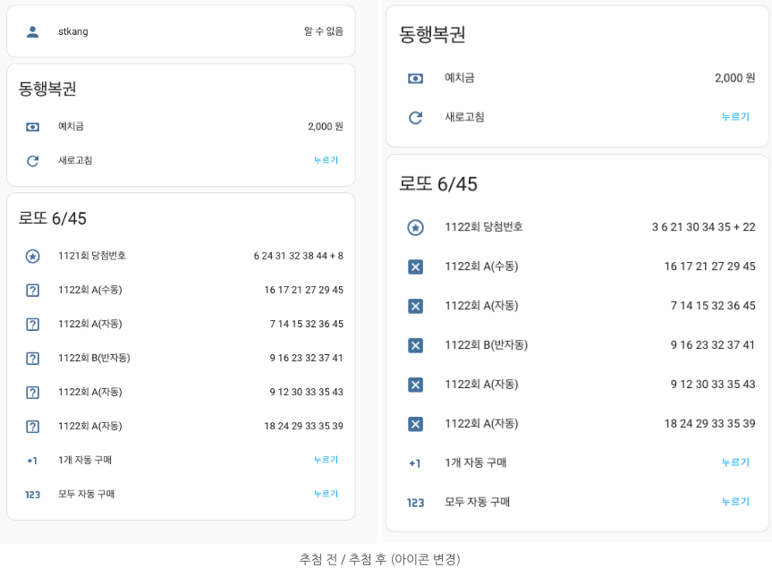
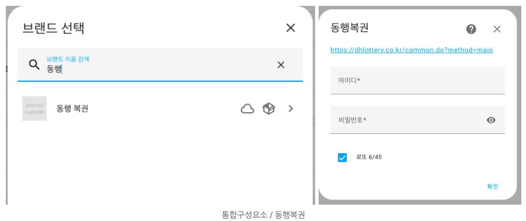
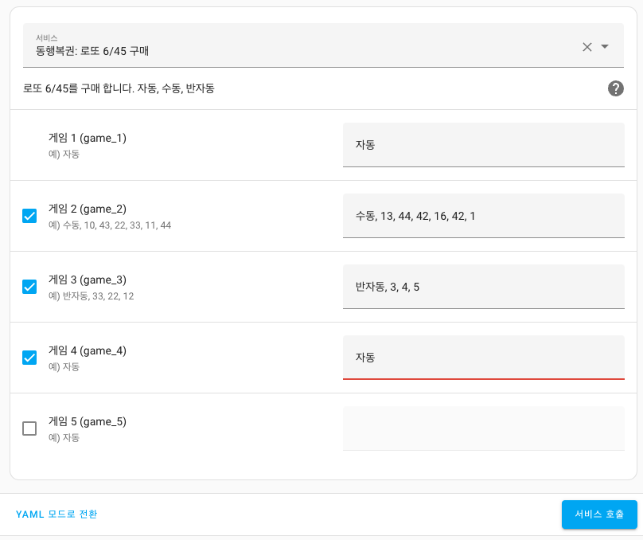

# 동행복권: 로또 6/45

![HACS][hacs-shield]



문의 : 네이버 [HomeAssistant카페](https://cafe.naver.com/koreassistant)

## 동행복권: 로또 6/45가 도움이 되셨나요?
TOSS로 기부하기  


## 준비물
- HomeAssistant `최신버전`


## 사용자 구성요소를 HA에 설치하는 방법
### HACS
- HACS > Integrations > 우측상단 메뉴 > `Custom repositories` 선택
- `Add custom repository URL`에 `https://gitlab.com/ha-custom/component/dh_lottery` 입력
- Category 는 `Integration` 선택 후 `ADD` 클릭
- HACS > Integrations 에서 `동행 복권` 찾아서 설치
- HomeAssistant 재시작

### 수동설치
- `https://gitlab.com/ha-custom/component/dh_lottery` 에서 `코드 -> 소스 코드 다운로드(zip)` 을 눌러 파일을 다운로드, 내부의 `dh_lottery` 폴더 확인
- HomeAssistant 설정폴더 `/config` 내부에 `custom_components` 폴더를 생성(이미 있으면 다음 단계)<br/>설정폴더는 `configuration.yaml` 파일이 있는 폴더를 의미합니다.
- `/config/custom_components`에 위에서 다운받은 `dh_lottery` 폴더를 넣기
- HomeAssistant 재시작

## 동행복권을 설치하기 전 선행과정
### 동행복권 사이트 회원가입
- [동행복권](https://dhlottery.co.kr/common.do?method=main) 에서 회원가입
- 예치금 충전


## 동행복권을 통합구성요소로 설치하는 방법
### 통합구성요소
- HomeAssistant 사이드패널 > 설정 > 기기 및 서비스 > 통합 구성요소 추가
- 검색창에서 `동행 복권` 입력 후 선택
- 아이디 비밀번호 입력
- 로또 6/45 체크 (추후 다른 게임도 추가 예정)




```yaml
# 예치금 및 복권 구매내역 수동 갠신
service: dh_lottery.refresh_lottery
data: {}

---

# 복권 구매
service: dh_lottery.buy_lotto_645
data:
  game_1: 자동
  game_2: 수동, 13, 44, 42, 16, 42, 1
  game_3: 반자동, 3, 4, 5
  game_4: 자동

```


[hacs-shield]: https://img.shields.io/badge/HACS-Custom-red.svg